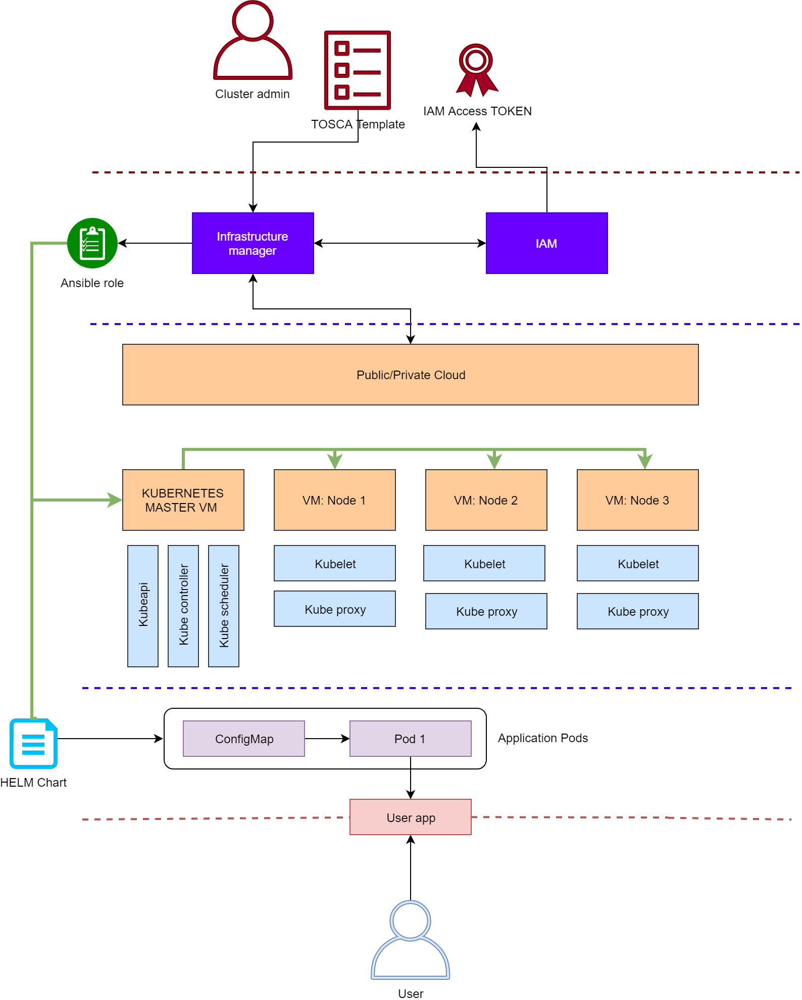

# WORK IN PROGRESS

## Components

- Admins authenticate with the Infrastructure Manager
  - using either username and password or a IAM access token
- IM uses the TOSCA template provided by the admin to deploy:
  - a k8s cluster
    - using the k8s ansible role [here](https://github.com/DODAS-TS/ansible-role-kubernetes)
      - also k3s availabel [here](https://github.com/DODAS-TS/ansible-role-k3s)
  - one or more helm charts on top of it
    - using the helm install ansible role [here](https://github.com/DODAS-TS/ansible-role-helm)
      - kubectl create of any manifest is also supported by an [ansible role](https://github.com/DODAS-TS/ansible-role-kubecreate)
  - any other action supported or integrated into a tosca node type